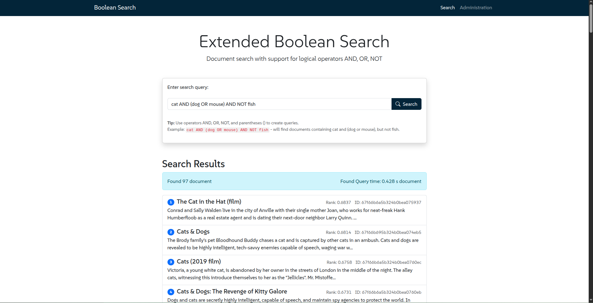
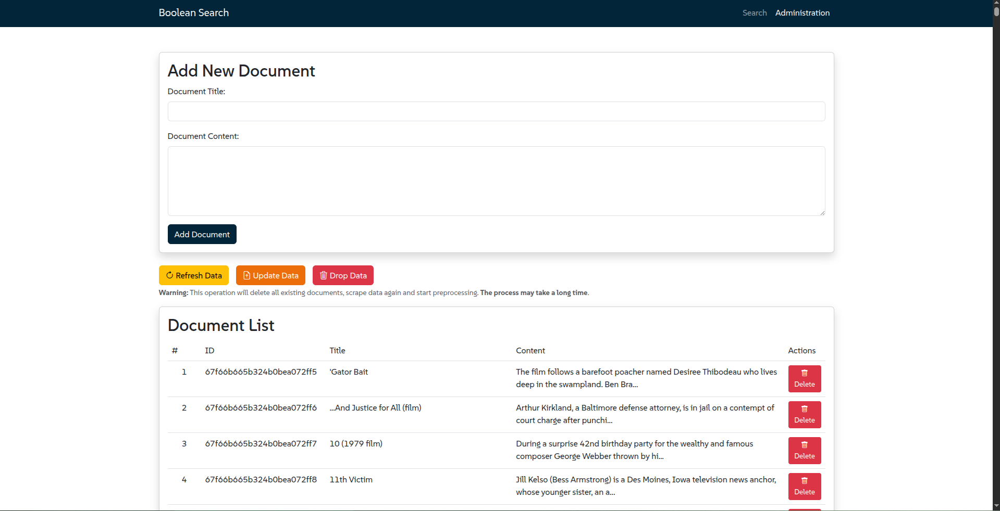

# Extended Boolean Document Search

A document search system using an extended Boolean model, supporting logical operators (AND, OR, NOT) with TF-IDF ranking.



## Features

- Document storage in MongoDB
- Advanced Boolean search with support for complex queries
- TF-IDF ranking system for relevant results
- Performance optimization with index caching
- Administrative panel with password protection

## Technologies and Dependencies

### Production Dependencies
- **Node.js** (>=22.14.0) - Runtime environment
- **Express.js** (^4.21.2) - Web application framework
- **MongoDB** (^6.14.2) - NoSQL document storage
- **jsep** (^1.4.0) - JavaScript expression parser for queries
- **natural** (^8.0.1) - NLP for text processing
- **stopword** (^3.1.4) - Stop words filtering
- **lodash** (^4.17.21) - Utility functions (here used for array set-like manipulations)
- **dotenv** (^16.4.7) - Environment configuration

### Frontend Dependencies
- **Bootstrap** (5.3.0) - CSS framework for responsive design
- **Bootstrap Icons** (1.10.0) - Icon library for UI elements

### Development Dependencies
- **nodemon** (^3.1.9) - Auto-reloading tool for development
- **object-sizeof** (^2.6.5) - Memory usage analysis

## Implementation Features

1. **Document Storage**
   - Documents are stored in MongoDB (version 6.14.2 or higher)
   - Efficient indexing system

2. **Search Implementation**
   - Case-insensitive and partial matching
   - TF-IDF weighting for ranking relevance
   - Boolean query processing (AND, OR, NOT)
   - Optimized inverted index structure
   - Support and/AND/&&, or/OR/||, not/NOT/! (doesn't matter how you combine them)

3. **Performance Optimization**
   - In-memory and MongoDB-based index storage
   - Performance comparison tools
   - Index normalization techniques

4. **Admin Panel Protection**
   - Password-based authentication
   - Secure document management interface

## Installation and Setup

### Prerequisites

- Node.js (version 22.14.0 or higher)
- MongoDB (version 6.0 or higher)

### Installation Steps

1. Clone the repository:
   ```bash
   git clone https://gitlab.fit.cvut.cz/pihaland/vwm-semestral-project.git
   cd vwm-semestral-project
   ```

2. Install dependencies:
   ```bash
   npm install
   ```

3. Create and configure the .env file, here is a template:
   ```
   MONGO_URI=mongodb://localhost:27017/extended_boolean_search
   MONGO_DB_NAME=extended_boolean_search
   ADMIN_PASSWORD=your_password
   PORT=3000
   ```

4. Start MongoDB (if not running):
   ```bash
   mongod --version  # check version
   systemctl start mongod # start MongoDB
   systemctl status mongod # check status
   ```

5. Start the application:
   ```bash
   npm start
   ```

   For development with auto-reload:
   ```bash
   npm run dev
   ```

## Usage

### Document Search

1. Open http://localhost:3000 in your browser
2. Enter a query using operators: AND, OR, NOT (e.g., "car OR (!apple AND win)")
3. View ranked results sorted by relevance

### Document Management (Admin Panel)

1. Open http://localhost:3000/admin.html in your browser
2. Enter the password (set in the .env file)
3. Use the form to add new documents
4. Use **Refresh button** to delete existing documents, scrap all *.csv files from folder '/data' and index gotten documents.
5. Use **Update button** to reindex all documents from DB.
   - Useful in case you add document with form in admin panel
   - As server doesn't reindex data automatically *(because it's not efficient)*
6. Use **Delete button** to remove all document from DB
7. View and manage the list of existing documents

## Project Structure

```
project-root/
├── backend/              # Server logic
│   ├── server.js         # Main server file
│   ├── db.js             # MongoDB operations
│   ├── searchEngine.js   # Search engine
│   └── textProcessor.js  # Text processing and indexing
├── frontend/             # Client-side
│   ├── index.html        # Search page
│   ├── admin.html        # Admin panel
│   ├── css/              # Styles
│   │   └── styles.css    
│   └── js/               # Client scripts
│       ├── search.js     
│       └── admin.js      
├── test/                 # Testing
│   └── comparePerformance.js  # Performance benchmarks
├── data/                 # Dataset folder
│   └── *.csv             # CSV files with document data
├── .env                  # Environment variables
└── package.json          # Project configuration
```

## Dataset
The system uses a dataset of documents in CSV format. You can use any CSV files with document data as long as they have columns for title and content. The expected format is:
```
title,content
"Document Title 1","This is the content of the first document..."
"Document Title 2","This is the content of the second document..."
```

### Sample Datasets
- [Wikipedia Movies](https://www.kaggle.com/datasets/exactful/wikipedia-movies/data?select=2010s-movies.csv) - The data contains American movie details from Wikipedia between the 1970s and 2020s. The data was compiled using the Wikipedia API and includes almost 18,000 movies.


*You can place your own CSV files in the /data/ folder to import them into the system.*

## Performance Testing
Run performance tests to compare index creation, search, and ranking speeds:

   ```bash
   node test/comparePerformance.js
   ```
This will output metrics including:
- Index creation time
- RAM usage statistics
- Search execution time
- MongoDB storage comparison


## Troubleshooting

### MongoDB Connection Issues

- Check that MongoDB is running: `systemctl status mongod`
- Verify the connection string in .env
- Check MongoDB logs: `journalctl -u mongod`
- Ensure MongoDB version is 6.0 or higher

### Server Startup Issues

- Verify that port 3000 is available (or change PORT in .env)
- Check that all dependencies are installed: `npm install`
- Check Node.js version (should be 22.14.0 or higher): `node --version`
- For permission issues, try running MongoDB with: `sudo systemctl start mongod`

### Development Issues

- For auto-reload during development, use: `npm run dev`
- Check console logs in browser developer tools
- Verify all required environment variables are set in .env

## License

This project is licensed under the MIT License.

